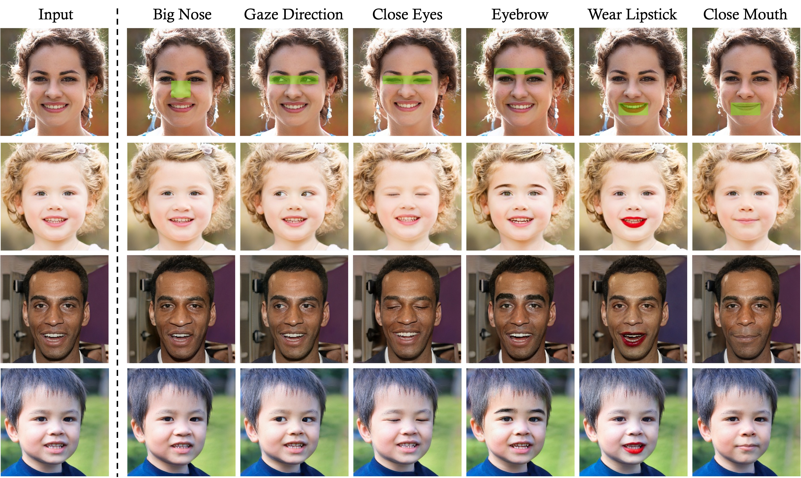

# Region-Based Semantic Factorization in GANs


**Figure:** *Image editing results using ReSeFa on BigGAN (first two columns) and StyleGAN2 (last three columns).*

> **Region-Based Semantic Factorization in GANs** <br>
> Jiapeng Zhu, Yujun Shen, Yinghao Xu, Deli Zhao, Qifeng Chen <br>
> arXiv preprint arXiv:2202.09649 <br>

[[Paper](http://arxiv.org/abs/2202.09649)]

In the repository, we propose a simple algorithm to interpret the region-based semantics learned by GANs. In particular, we re-examine the task of local editing with pre-trained GAN models, and formulate region-based semantic discovery as a dual optimization problem. Through an appropriately defined generalized Rayleigh quotient, we are able to tackle such a problem super efficiently with a closed-form solution. Extensive experiments on BigGAN and StyleGAN2 demonstrate the effectiveness and robustness of our proposed method.

## Local Face Editing



**Figure:** *Semantics found by ReSeFa with respect to the region of interest (i.e., within the green boxes).*

## Code coming soon

## BibTeX

```bibtex
@article{zhu2022resefa,
  title   = {Region-Based Semantic Factorization in GANs},
  author  = {Zhu, Jiapeng and Shen, Yujun and Xu, Yinghao and Zhao, Deli and Chen, Qifeng},
  journal = {arXiv preprint arXiv:2202.09649},
  year    = {2022}
}
```
